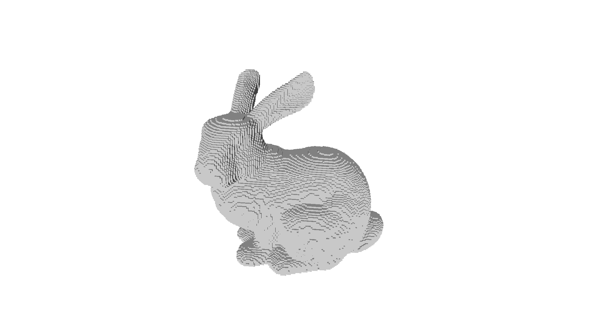
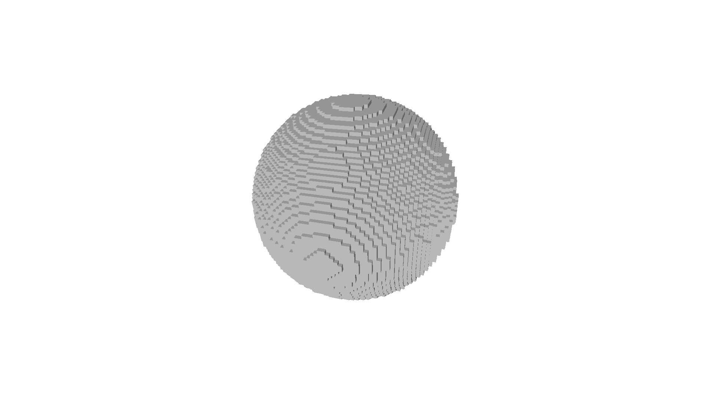
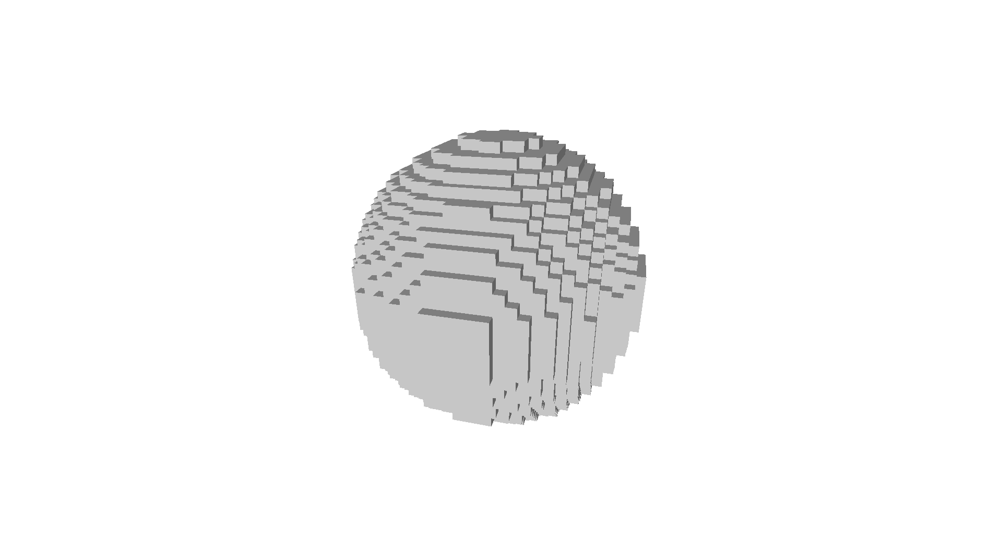
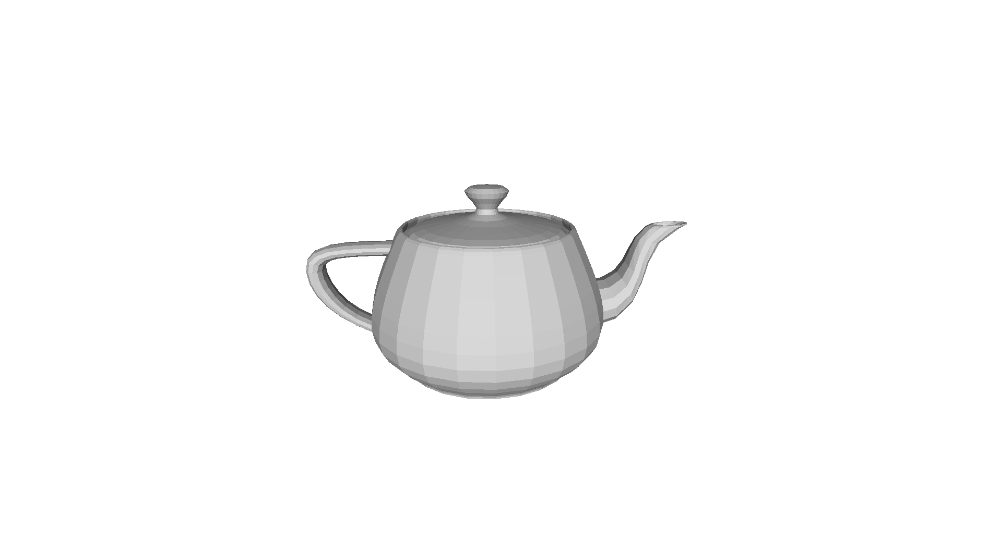
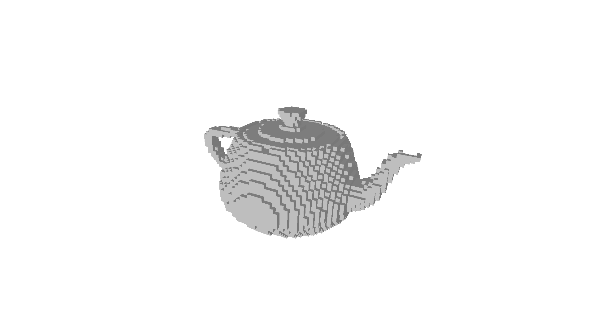
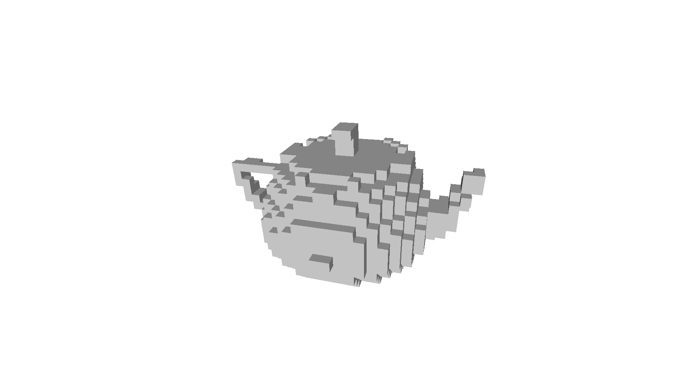
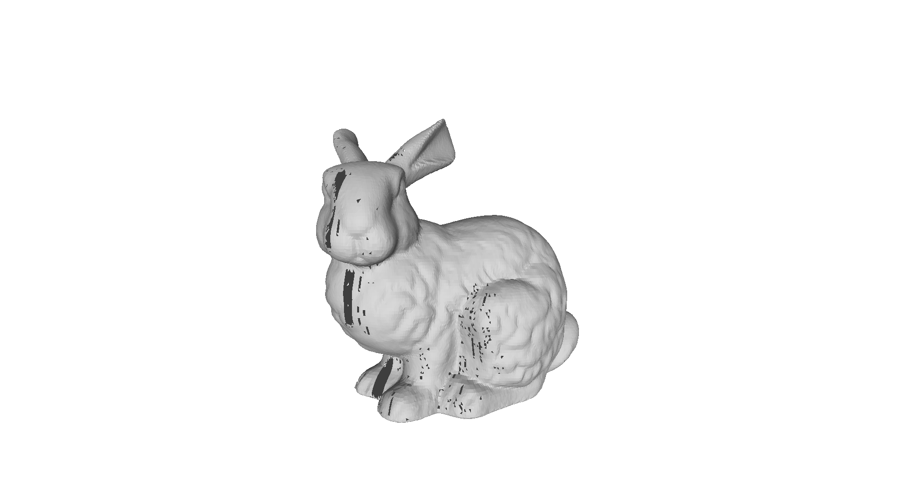
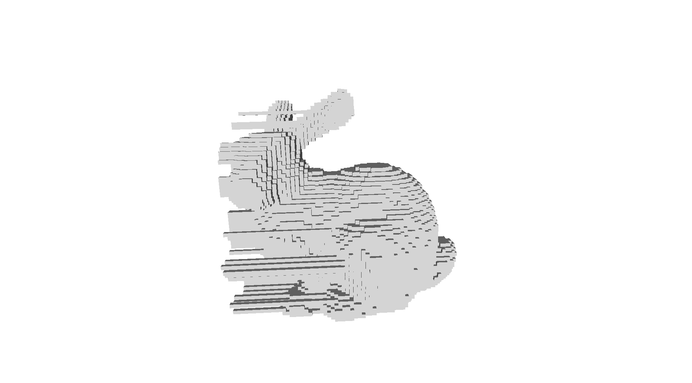
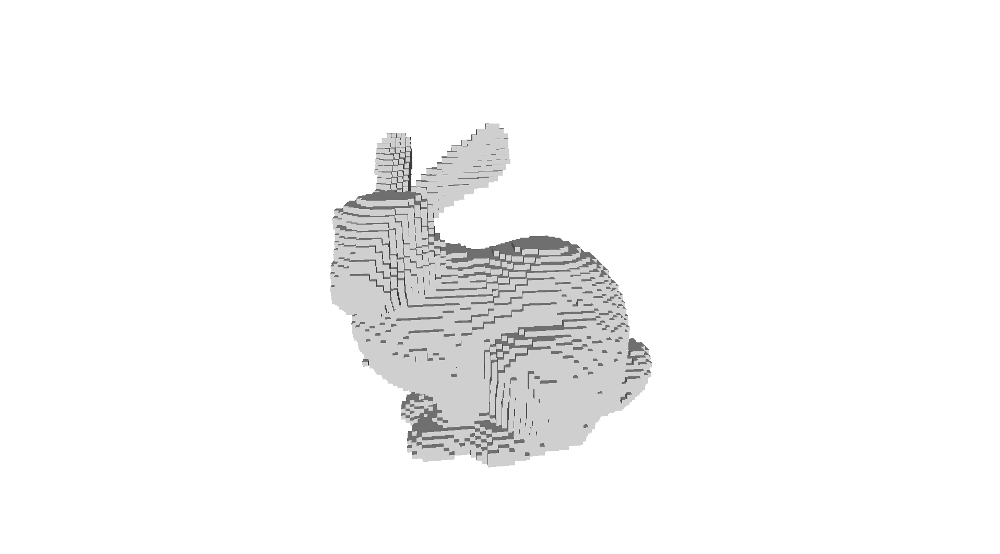

# CUDA C mesh voxelizer

This is a simple voxelization engine made for MIT's 6.807 Computational Fabrication. Given a .obj mesh, this will output a voxel grid in the form of another .obj file. This voxelizer relies on CUDA for acceleration of the inherently parallel voxelization process.

**WARNING**: this can generate some BIG files and make your computer very sad. Keep the resolution below around 128 for safety. Higher can be achieved, but a more efficient storage method would probably be wise first.

Using resolution of 256 I generated a 4.7 GB voxel file containing over 67 million vertices. This just about crashed my computer as I obliterated my poor swap space. On the bright side, it only took 2.8 seconds to generate...

This voxelizer is built on:

- [Möller–Trumbore intersection algorithm](https://en.wikipedia.org/wiki/M%C3%B6ller%E2%80%93Trumbore_intersection_algorithm)
- CUDA

You can visualize the output file with MeshLab.

### Usage:

./voxelizer [options] [input path] [ouput path]

Options: 

    -s, --samples     : number of sample rays per vertex    

    -v, --verbose     : Verbosity level. Multiple flags for more verbosity.    

    -r, --resolution  : voxelization resolution    

    -h, --help        : Displays usage information and exits.

Arguments:

    [input path] : path to .obj mesh

    [ouput path] : path to save voxel grid

Example usage: 

64x64x64 resolution, output to ./data/sphere/sphere_voxelized.obj
```
./voxelizer -r 64 ./data/sphere/sphere.obj ./data/sphere/sphere_voxelized.obj
```

64x64x64 with 11 randomized direction samples to work with a broken mesh
```
./voxelizer -r 64 -s 11 ./data/sphere/broken_sphere.obj ./data/sphere/broken_sphere_voxelized.obj
```

### Build instructions:

You will need NVIDIA CUDA for this to compile properly.

```
mkdir build
cd build
cmake ..
make
```

### References

- This was very useful for implementing the GPU ray-triangle intersection [https://en.wikipedia.org/wiki/M%C3%B6ller%E2%80%93Trumbore_intersection_algorithm](https://en.wikipedia.org/wiki/M%C3%B6ller%E2%80%93Trumbore_intersection_algorithm)
- Last semester's graphics assignment in which I implemented ray-triangle intersection
- The CUDA documentation
- The given skeleton code

### Known Problems

There are no known problems with the code. It gets a bit squirly if given very large resolutions, but that's not a surprise.

### Extra Credit

I implemented the voxelization algorithm on the GPU with CUDA. This gives a massive speedup - on the order of 300 times faster than the sample executable.

Additionally, I implemented multiple sampling for incomplete blocks. Using the -s or --samples argument allows you to specify how many random directions are tested.

### Notes

I liked this assignment!

### Benchmarks

I tested this out with the same parameters as the given executable for all of the given shapes. These are the results on my GTX970:

Size 64x64x64

Sphere (280x speedup)
Num Triangles: 960
GPU algorithm: 0.117473 seconds
CPU algorithm: 32.9294 seconds

Bunny (742x speedup)
Num Triangles: 69664
GPU algorithm: 3.25967 seconds
CPU algorithm: 2419.65 seconds

Teapot (430x speedup)
Num Triangles: 2464
GPU algorithm: 0.195217 seconds
CPU algorithm: 84.0355 seconds

### Pictures

Example mesh bunny

voxelized to 128x128x128 (with 5 samples - 125 seconds)

voxelized to 64x64x64 (3.25 seconds)

voxelized to 32x32x32


Example mesh sphere

voxelized to 64x64x64 (.12 seconds)

voxelized to 32x32x32


Example mesh teapot

voxelized to 64x64x64 (.20 seconds)

voxelized to 32x32x32


Example mesh with gaps


Broken mesh with fixed direction


Broken mesh with 11 randomly sampled directions
